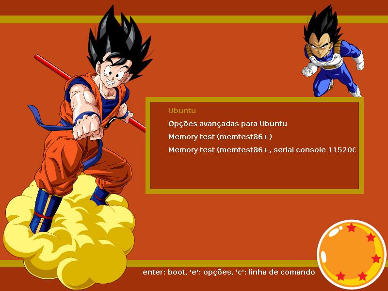

# DBZ-GRUB2-Theme
Theme for GRUB2 based on the anime Dragon Ball z

<h3>Install</h3>

1 - Copy the contents of the folder "dbz-theme" for your grub directory of topics. I recommend creating the directory "/ boot / grub / themes"
```Shell
sudo cp -R dbz-theme/ /boot/grub/themes
```

2 - add or modify the next line in the file /etc/default/grub:
```Shell
GRUB_THEME="/boot/grub/themes/dbz-theme/theme.txt"
```

3 - Update the configurations:
```Shell
sudo update-grub
```

<h3>Screenshot</h3>



<h3>Supported Resolutions</h3>
<ul>
<li>800   x 600</li>
<li>1024  x 768</li>
<li>1366 x 768</li>
</ul>
